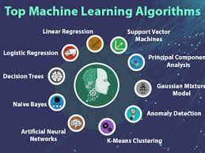

### Publication
Ratnabali Pal

### Abstract
Using Python to solve and achieve state-of-the-accuracy for regression and classification problems.uploads codes for 
following datasets:
1.wine quality datasets
2.Pima-diabetics
3.Iris datasets
4.Boston- house price
5.Sonar-All datasets
6.Seeds datasets
7.Ionosphere datasets
8.Abalone datasets
9.Banknote datasets
10.Swedish Auto Insurance Dataset

### License

Copyright © 2021 Ratnabali Pal

The content of this repository is bound by the following licenses:

- The documents and data are licensed under the MIT license.
